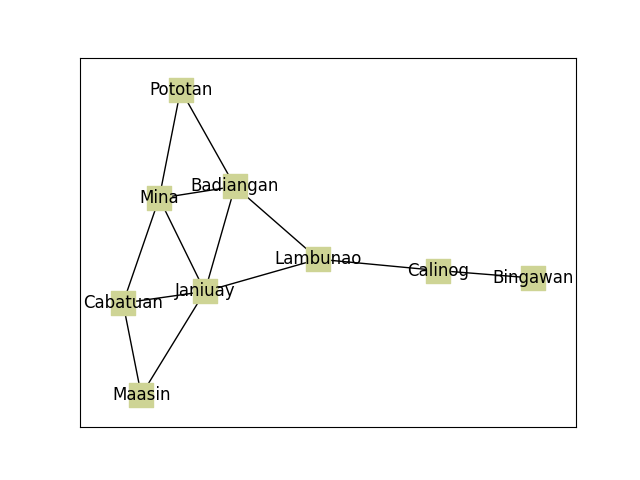
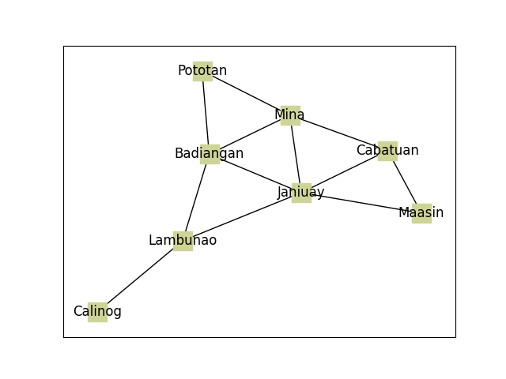

# Depth-first search (DFS)

> is algorithm for traversing or searching tree or graph data structures. The algorithm starts at the root node (selecting some arbitrary node as the root node in the case of a graph) and explores as far as possible along each branch before backtracking.

## Code
	```python
	  def depth_first_search(graph: nx.Graph, start, target) -> nx.Graph | None:
	      # Copied from https://github.com/TheAlgorithms/Python/blob/master/graphs/depth_first_search.py
	      visited, stack = set(start), [start]
	      step = 0
	      
	      while stack:
	          current = stack.pop()
	          step += 1
	          print(f"Step: {step} @ Node: {current}")
	          visited.add(current)
	          if (current == target):
	              def nodes_filter(x):
	                  return x in visited
	              return nx.subgraph_view(graph, nodes_filter)
	          for adjacent in (graph[current]):
	              if adjacent not in visited:
	                  stack.append(adjacent)
	          print(stack)
	      
	      return None
	```

## Problem

	Third District of Iloilo
		<!--  -->
		Suppose that we are foreigners that just moved to Pototan and would like to meet up with a relative who so happens to live in Calinog. The meeting was supposed to happen in Calinog at the end of the day, and so we decided to use the rest of the day to explore as much of the Third District of Iloilo as sightseeing. We have a map at hand and so we decided to explore various municipalities of the Third District before we end up in Calinog.
		Output
			Graph Representation
				
			Municipalities visited by DFS
				
			Console Output
				```
				  Step: 1 @ Node: Pototan
				  ['Badiangan', 'Mina']
				  Step: 2 @ Node: Mina
				  ['Badiangan', 'Janiuay', 'Badiangan', 'Cabatuan']
				  Step: 3 @ Node: Cabatuan
				  ['Badiangan', 'Janiuay', 'Badiangan', 'Janiuay', 'Maasin']
				  Step: 4 @ Node: Maasin
				  ['Badiangan', 'Janiuay', 'Badiangan', 'Janiuay', 'Janiuay']
				  Step: 5 @ Node: Janiuay
				  ['Badiangan', 'Janiuay', 'Badiangan', 'Janiuay', 'Lambunao']
				  Step: 6 @ Node: Lambunao
				  ['Badiangan', 'Janiuay', 'Badiangan', 'Janiuay', 'Calinog', 'Badiangan']
				  Step: 7 @ Node: Badiangan
				  ['Badiangan', 'Janiuay', 'Badiangan', 'Janiuay', 'Calinog']
				  Step: 8 @ Node: Calinog
				```
			<!-- Discussion -->
			<!-- 	[[draws/2023-08-23-23-46-40.excalidraw]] -->
